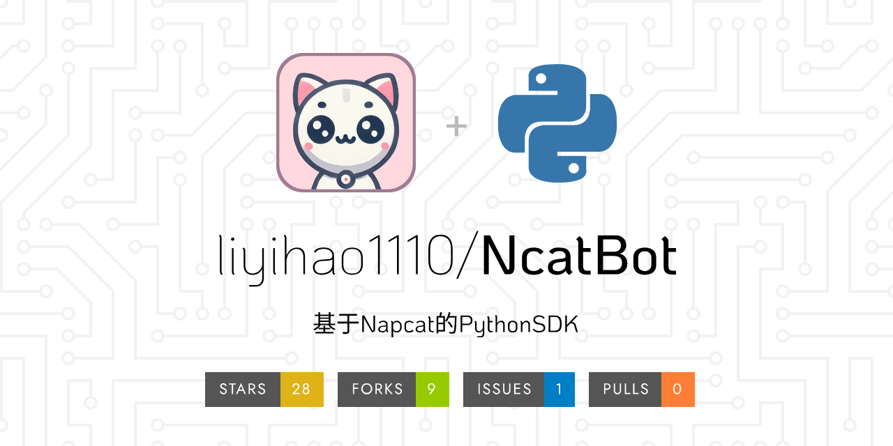
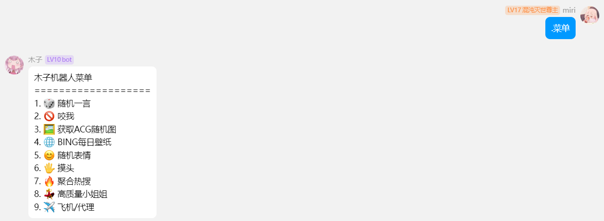

## ncatbot

---


ncatbot是一个开源的基于NapCat的QQ个人号PYTHON库，使用python调用NTQQ。

使用简单的代码，你就可以完成一个能够处理所有信息的QQ机器人。

该PYTHON项目的机器人包含了内置指令，运行即用；除此之外，项目内置了NapCat一键启动。

希望这个项目能够帮助你扩展你的个人的QQ号、方便自己的生活。

## 安装

---
可以通过本命令安装ncatbot：
```commandline
git clone https://gitee.com/li-yihao0328/nc_bot.git
```
## 简单入门实例

---
在开始开发机器人之前，你需要先配置config.yaml文件，它可以帮助你自启动napcat和项目内部指令。
这是一份配置文件示例，你可以根据你的实际情况进行修改：
```yaml
ws:
  protocol: ws
  ip: 127.0.0.1
  port: 3001
  token: 选填，随意填写，建议填写内容

http:
  protocol: http
  ip: 127.0.0.1
  port: 3000
  token: 选填，随意填写，建议填写内容

ai:
  base_url: 选填
  api_key: 选填
  model: 选填
  personality: 选填

qq:
  bot: 机器人QQ账号，必填
  user: 管理员账号，必填

nap_cat: 你的NapCat.Shell文件夹的路径地址，当然如果你没有下载的话，可以填入NapCat.Shell文件的下载地址，他将会自行下载，不过github需要国外网络环境，所以填入网址运行，请提前准备网络环境，否则会下载安装失败。
```
当你填写好了config.yaml之后，你就可以直接运行以下代码:
```python
from ncatbot.client import BotClient
bot = BotClient()

bot.run(reload=False)
```
运行后，napcat将会自启动，并且根据config.yaml内的配置对napcat进行配置。

有了ncatbot，运行后你可以使用这些指令：
```python
from ncatbot.client import BotClient
bot = BotClient()

bot.run(reload=True)# reload=True 表示你不需要运行启动NapCat
```
你不需要编写任何代码，即可使用内置指令，不过你需要在config.yaml内填写管理员QQ账号，即`user`。
运行后，你可以在QQ上向机器人发送“/帮助”来获取引导。

如果你想要回复发给机器人的文本消息，只需要这样：
```python
from ncatbot.client import BotClient
from ncatbot.message import GroupMessage,PrivateMessage

bot = BotClient()

@bot.group_event()
async def on_group_message(msg:GroupMessage):
    print(msg)
    if msg.raw_message == "test":
        await msg.reply(text="test")

@bot.private_event()
async def on_private_message(msg:PrivateMessage):
    print(msg)
    # 私聊同理

bot.run(reload=True)
```
一些进阶应用可以在下面的开源机器人的源码和进阶应用中看到，或者你也可以阅览[文档](https://docs.ncatbot.xyz/)
## 试一试

---
这是一个基于这一项目的开源小机器人，百闻不如一见，有兴趣可以[进群](https://qm.qq.com/q/L6XGXYqL86)尝试一下。

## 进阶应用

---
**特殊的字典使用方式**

通过打印ncatbot的用户以及注册消息的参数，可以发现这些值都是字典。

但实际上ncatbot精心构造了群聊和私聊的键值，使得字典的使用更加方便，不过notice和request事件的键值则需要使用字典的键值访问。

群聊和私聊所有的键值都可以通过这一方式访问：
```python
@bot.group_event()
async def on_group_message(msg:GroupMessage):
    # 等价于print(msg["raw_message"])
    print(msg.raw_message)
```
**各类型消息的注册**

ncatbot支持了napcat客户端所有的事件，包括群聊、私聊、通知、请求等。
```python
from ncatbot.client import BotClient
from ncatbot.message import GroupMessage,PrivateMessage

bot = BotClient()

@bot.group_event()
async def on_group_message(msg:GroupMessage):
    print(msg)

@bot.private_event()
async def on_private_message(msg:PrivateMessage):
    print(msg)

@bot.notice_event()
async def on_notice_message(msg):
    print(msg)
@bot.request_event()
async def on_request_message(msg):
    print(msg)
    
bot.run(reload=True)
```
**各消息类型的注册**
举个例子，例如，如果你想要监听群聊的文本消息，你可以这样注册：
```python
from ncatbot.client import BotClient
from ncatbot.message import GroupMessage
bot = BotClient()

@bot.group_event(["text"])
async def on_group_message(msg:GroupMessage):
    print(msg)
    
bot.run(reload=True)
```
当你需要监听所有消息类型时，你可以这样注册：
```python
from ncatbot.client import BotClient
from ncatbot.message import GroupMessage
bot = BotClient()

@bot.group_event()
async def on_group_message(msg:GroupMessage):
    print(msg)
    
bot.run(reload=True)
```
需要注意的是：<mark>只要消息内存在文本，这个消息就会被监听，而不是纯文本才会被监听</mark>

## 如何获取帮助

---
欢迎[进群](https://qm.qq.com/q/L6XGXYqL86)和提issue
## 联系作者

---
作者：[木子](https://gitee.com/li-yihao0328)

邮箱：yihaoli_2002@foxmail.com
## 贡献者们

---
[liyihao1110](https://github.com/liyihao1110);
[gaojj2000](https://github.com/gaojj2000);
[Isaaczhr](https://github.com/Isaaczhr);
[Fish-LP](https://github.com/Fish-LP)

如果你有好的idea，欢迎提issue和pr！

## 致谢

---
感谢 [NapCat](https://github.com/NapNeko/NapCatQQ)


